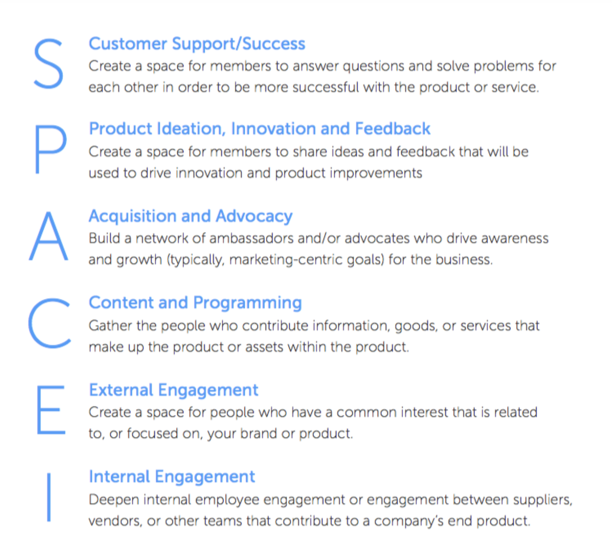

# SPACEI Model

The **SPACES model** can be used as a framework for defining your **community's business value.**

This model was originally conceived by [**David Spinks**](https://twitter.com/DavidSpinks) with contributions from [**Carrie Mellisa Jones**](https://twitter.com/caremjo) **and** [**Evan Hamilton.**](https://twitter.com/evanhamilton) ****

The below image briefly explains all the aspects of the SPACE Model.

According to the SPACE model all communities inherently derive their business values from one of the following areas:

In his [blog post](https://cmxhub.com/the-space-model/) featured in CMX Hub, David Spinks has completely mentioned each and every aspect of the spaces model and choosing which objectives to focus on. 

It is a must read for every community professional.

