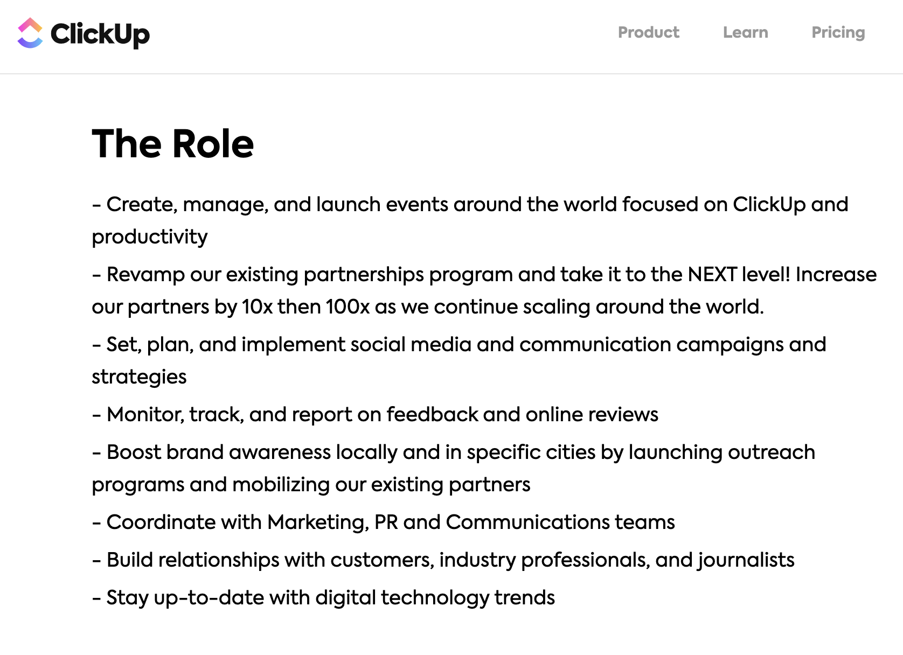
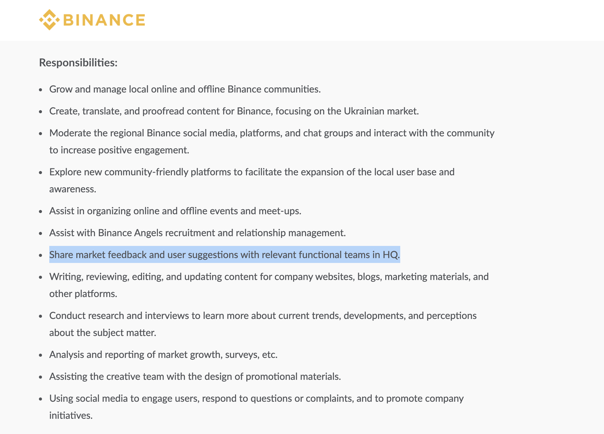

# Real CMGR JDs and How to acquire those skills?

This guide is meant to inspire action and be a ready reckoner guide rather than a theoretical piece of work.

So in this module we will look at some actual community manager job posts and will guide you how we can help you acquire those skills and be industry ready.

## 1. Community Manager Role at Clickup.

Now lets go through how to acquire the skills required for this job by using this guide.

1. Creating and laucnching events world wide. Both inperson and online.



     2.Revamp partnership programs: Learn more about increasing engagements.



3. Community Strategies

4. networking properly and building relationships with customers.

## 2. Community Manager Role at Binance.

Now lets go through how to acquire the skills required for this job by using this guide.

Growing online and offline communities.

Moderating content for binance.



analysis of market growth.

